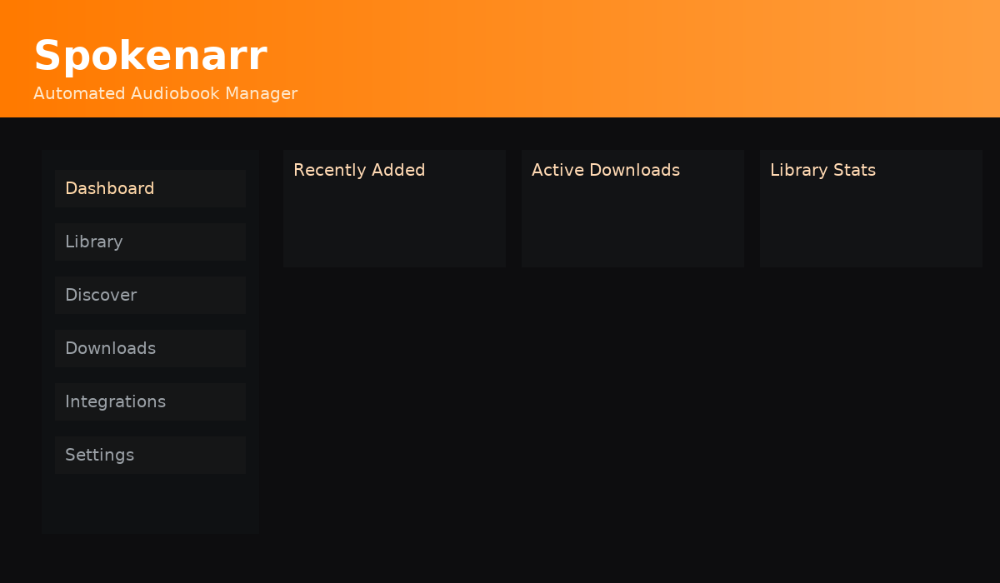

<div align="center">
  

# 🎧 Spokenarr

**Automated Audiobook Manager inspired by Readarr**

_Download, organize, and track your audiobooks automatically._
</div>

---

## ✨ Features

- 🔍 Integrates with **Prowlarr**, **NZBGet**, and **Deluge** (external instances)
- 📚 Searches **AudiobookBay** for magnets
- 🧠 Automatically imports completed downloads
- 🗂 Organizes your audiobooks into structured folders
- 🎨 Modern orange-gradient UI

---

## 🖥️ Web UI Preview



---

Ports (default):
- API: http://localhost:5080
- Web (Storybook): http://localhost:6080

## 🚀 Quick Start (Docker Compose)

### Git
```bash
git clone https://github.com/nate872711/spokenarr.git
cd spokenarr
docker compose up --build
```

### Example docker-compose

```yaml
services:
  postgres:
    image: postgres:15
    container_name: spokenarr-postgres
    environment:
      POSTGRES_USER: ${POSTGRES_USER:-spokenarr}
      POSTGRES_PASSWORD: ${POSTGRES_PASSWORD:-spokenarr_pass}
      POSTGRES_DB: ${POSTGRES_DB:-spokenarr}
    volumes:
      - pgdata:/var/lib/postgresql/data
    restart: unless-stopped

  spokenarr-api:
    build: ./backend
    image: nate8727/spokenarr-api:latest
    container_name: spokenarr-api
    environment:
      - DATABASE_URL=${DATABASE_URL}
      - SETTINGS_PATH=/app/config/settings.json
    depends_on:
      - postgres
    ports:
      - "${API_HOST_PORT:-5080}:80"
    volumes:
      - ./backend/app:/app/app:ro
    restart: unless-stopped

  spokenarr-web:
    build: ./frontend
    image: nate8727/spokenarr-web:latest
    container_name: spokenarr-web
    depends_on:
      - spokenarr-api
    ports:
      - "${WEB_HOST_PORT:-6080}:3000"
    volumes:
      - ./frontend:/app:rw
    restart: unless-stopped

volumes:
  pgdata:
```


## Notes
- Integrations (Prowlarr, Deluge, NZBGet) are configurable in settings (disabled by default).
- CI pushes images to Docker Hub repos `nate8727/spokenarr-api` and `nate8727/spokenarr-web`.
